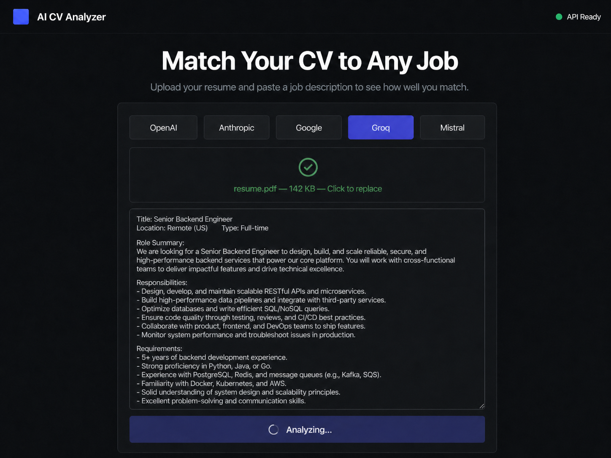
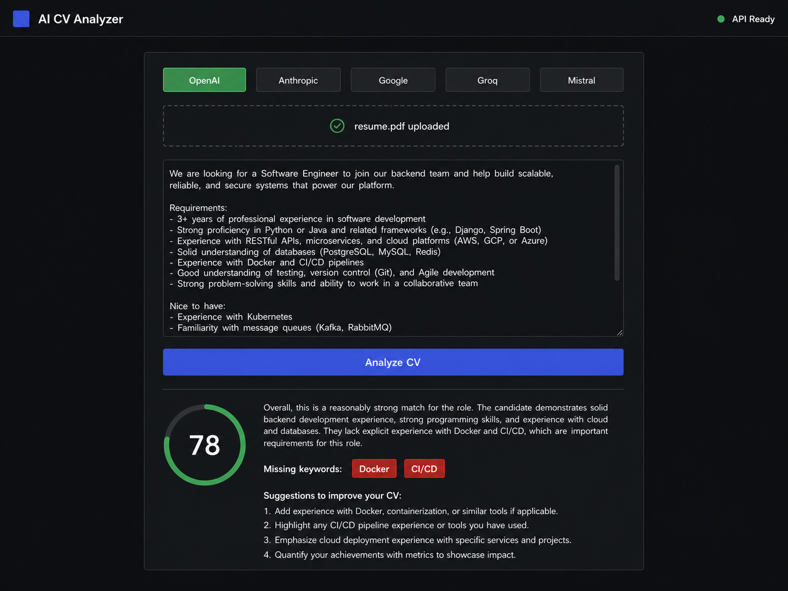
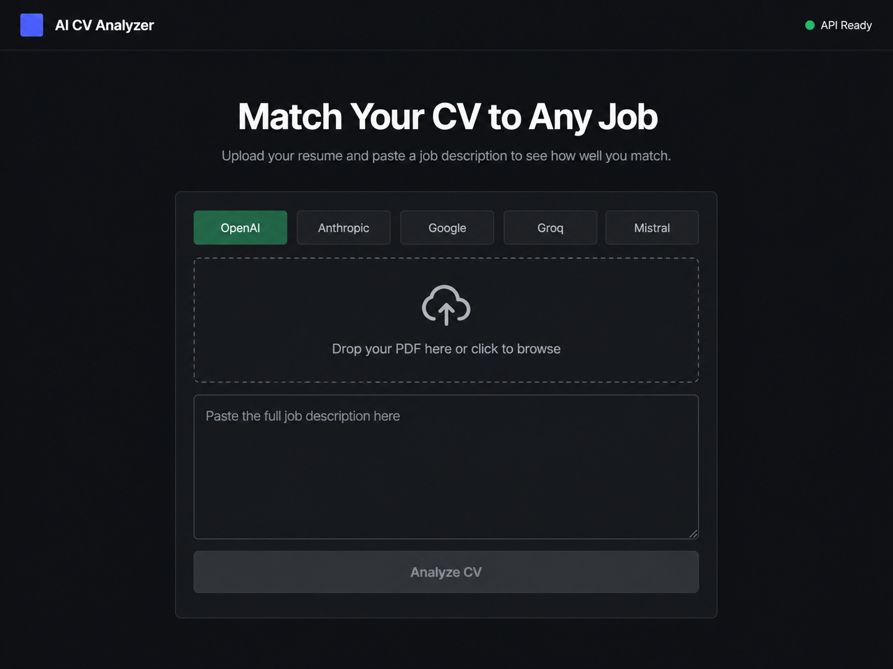
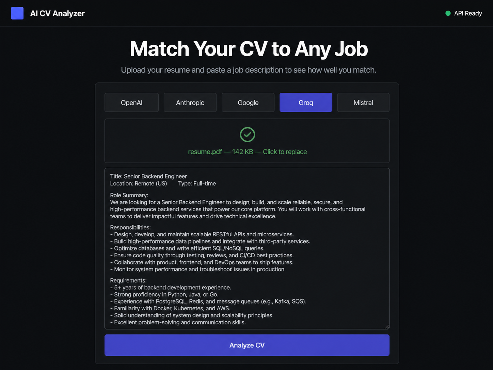

<div align="center">

  # 🤖 AI CV Analyzer

  **Match your resume to any job description using the power of 5 different AI models.**

  <p align="center">
    <a href="https://reactjs.org/"></a>
    <a href="https://fastapi.tiangolo.com/"></a>
    <a href="https://tailwindcss.com/"></a>
    <a href="https://www.docker.com/"></a>
  </p>

</div>

---

## 📸 Screenshots

| Home | Upload Ready |
|:---:|:---:|
|  |  |

| Analyzing | Results |
|:---:|:---:|
|  |  |

---

## ✨ Overview

**AI CV Analyzer** is a modern web application that evaluates your resume against a specific job description. It uses an ATS (Applicant Tracking System) approach powered by Large Language Models to give you an accurate fit score, identify missing keywords, and provide actionable suggestions to improve your chances.

---

## 🌟 Features

| Feature | Description |
|:---|:---|
| 📄 PDF Upload | Drag-and-drop or click to upload your CV (PDF only) |
| 💼 JD Matching | Paste any job posting text for analysis |
| 🤖 5 AI Providers | Switch between providers from the UI — no code change needed |
| 📊 ATS Score | Animated 0–100 circular score ring |
| 🏷️ Missing Keywords | See exactly which keywords the JD expects that your CV lacks |
| 💡 Suggestions | Numbered, role-specific improvement tips |
| 🐳 Docker Ready | One command to run the full stack |

---

## 🤖 Supported AI Providers

| Provider | Model | Cost |
|:---|:---|:---|
| 🟢 OpenAI | `gpt-4o` | Paid |
| 🟠 Anthropic | `claude-sonnet-4-20250514` | Paid |
| 🔵 Google | `gemini-1.5-pro` | Free tier available |
| 🟣 Groq | `llama-3.3-70b-versatile` | **Free & fastest** |
| 🔴 Mistral | `mistral-large-latest` | Paid |

> 💡 **New to this?** Start with **Groq** — it's completely free, requires no credit card, and is the fastest option.

---

## 🚀 Quick Start

### 1. Clone & Configure

```bash
git clone https://github.com/Omerfaruk-aydn/ai-cv-analyzer.git
cd ai-cv-analyzer
cp backend/.env.example backend/.env
```

Edit `backend/.env` and add only the key(s) you need:

```env
AI_PROVIDER=groq
GROQ_API_KEY=gsk_...
```

### 2. Run the Backend

```bash
cd backend
python -m venv venv
venv\Scripts\activate        # Windows
pip install -r requirements.txt
uvicorn main:app --reload --port 8000
```

API docs → [http://localhost:8000/docs](http://localhost:8000/docs)

### 3. Run the Frontend

```bash
cd frontend
npm install
npm run dev
```

App → [http://localhost:5173](http://localhost:5173)

---

## 🐳 Docker (One Command)

```bash
docker-compose up --build
```

App → [http://localhost](http://localhost)

---

## 🔑 Getting API Keys

| Provider | Link | Notes |
|:---|:---|:---|
| Groq | [console.groq.com/keys](https://console.groq.com/keys) | Free, no credit card |
| OpenAI | [platform.openai.com/api-keys](https://platform.openai.com/api-keys) | Paid |
| Anthropic | [console.anthropic.com](https://console.anthropic.com/settings/keys) | Paid |
| Google | [aistudio.google.com](https://aistudio.google.com/app/apikey) | Free tier |
| Mistral | [console.mistral.ai](https://console.mistral.ai/api-keys) | Paid |

---

## 📁 Project Structure

```
ai-cv-analyzer/
├── backend/
│   ├── main.py          # FastAPI endpoints
│   ├── ai_provider.py   # Unified AI abstraction layer
│   ├── analyzer.py      # CV vs JD analysis logic
│   ├── cv_parser.py     # PDF text extraction
│   ├── models.py        # Pydantic schemas
│   └── requirements.txt
├── frontend/
│   └── src/
│       ├── components/
│       │   ├── UploadForm.jsx
│       │   ├── ResultDashboard.jsx
│       │   └── ProviderSelector.jsx
│       └── App.jsx
├── docs/                # Screenshots
├── docker-compose.yml
└── README.md
```

---

## 🛠️ Tech Stack

| Layer | Technology |
|:---|:---|
| Frontend | React 18, Vite, TailwindCSS, Axios |
| Backend | Python 3.11, FastAPI, Pydantic |
| PDF Parsing | PyMuPDF (fitz) |
| AI | OpenAI, Anthropic, Google GenAI, Groq, Mistral SDKs |
| Infrastructure | Docker, Docker Compose, Nginx |

---

<div align="center">
  Made by <a href="https://github.com/Omerfaruk-aydn"><b>Omerfaruk-aydn</b></a>
</div>
